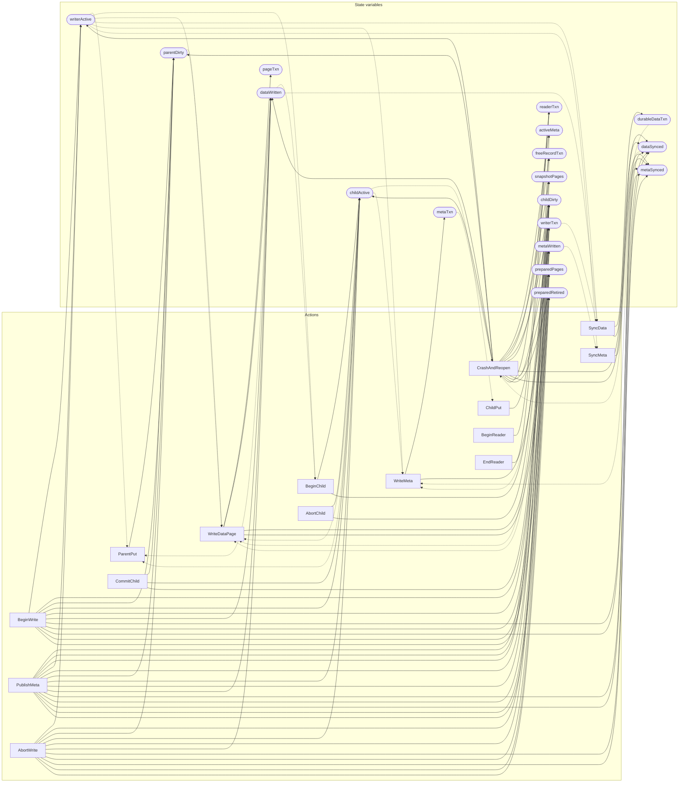

<!-- GENERATED FILE: do not edit. Regenerate with `make -C zig tla-viz` (scripts/tla-viz/gen_structural.py). -->

# AntflyLmdbCommit — structural diagrams

Generated from [`AntflyLmdbCommit.tla`](../../../storage/lmdb/AntflyLmdbCommit.tla). 18 state variables, 15 actions in `Next`. 2 expected-failure mutant action(s) (gated by `Buggy*` constants) omitted.

## Actions and the state they touch

| Action | Reads (incl. helper operators) | Writes |
| --- | --- | --- |
| `BeginWrite` | `activeMeta`, `metaTxn`, `writerActive` | `writerActive`, `writerTxn`, `parentDirty`, `childActive`, `childDirty`, `dataWritten`, `dataSynced`, `metaWritten`, `metaSynced`, `preparedPages`, `preparedRetired` |
| `ParentPut` | `writerActive`, `childActive`, `dataWritten` | `parentDirty` |
| `BeginChild` | `writerActive`, `childActive`, `dataWritten` | `childActive`, `childDirty` |
| `ChildPut` | `childActive` | `childDirty` |
| `CommitChild` | `childActive`, `childDirty` | `parentDirty`, `childActive`, `childDirty` |
| `AbortChild` | `childActive` | `childActive`, `childDirty` |
| `WriteDataPage` | `activeMeta`, `metaTxn`, `pageTxn`, `snapshotPages`, `freeRecordTxn`, `writerActive`, `writerTxn`, `parentDirty`, `childActive`, `dataWritten`, `readerTxn` | `pageTxn`, `dataWritten`, `preparedPages`, `preparedRetired` |
| `SyncData` | `writerActive`, `writerTxn`, `dataWritten`, `dataSynced` | `durableDataTxn`, `dataSynced` |
| `WriteMeta` | `activeMeta`, `metaTxn`, `writerActive`, `writerTxn`, `childActive`, `dataSynced`, `metaWritten` | `metaTxn`, `metaWritten` |
| `SyncMeta` | `writerActive`, `metaWritten`, `metaSynced` | `metaSynced` |
| `PublishMeta` | `activeMeta`, `snapshotPages`, `freeRecordTxn`, `writerActive`, `writerTxn`, `metaSynced`, `preparedPages`, `preparedRetired` | `activeMeta`, `snapshotPages`, `freeRecordTxn`, `writerActive`, `writerTxn`, `parentDirty`, `childActive`, `childDirty`, `dataWritten`, `dataSynced`, `metaWritten`, `metaSynced`, `preparedPages`, `preparedRetired` |
| `AbortWrite` | `writerActive`, `dataWritten` | `writerActive`, `writerTxn`, `parentDirty`, `childActive`, `childDirty`, `dataWritten`, `dataSynced`, `metaWritten`, `metaSynced`, `preparedPages`, `preparedRetired` |
| `CrashAndReopen` | `activeMeta`, `metaTxn`, `durableDataTxn`, `snapshotPages`, `freeRecordTxn`, `writerActive`, `writerTxn`, `metaSynced`, `preparedPages`, `preparedRetired` | `activeMeta`, `snapshotPages`, `freeRecordTxn`, `writerActive`, `writerTxn`, `parentDirty`, `childActive`, `childDirty`, `dataWritten`, `dataSynced`, `metaWritten`, `metaSynced`, `preparedPages`, `preparedRetired`, `readerTxn` |
| `BeginReader` | `activeMeta`, `metaTxn`, `readerTxn` | `readerTxn` |
| `EndReader` | `readerTxn` | `readerTxn` |

## Write graph

Solid edges: the action updates the variable. Dotted edges: the action's own definition reads the variable (reads via helper operators appear in the table above, not here).

