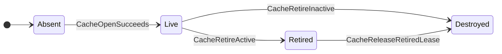
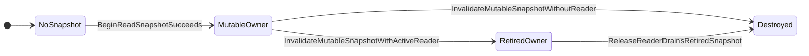
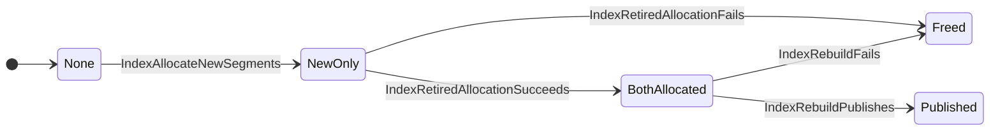
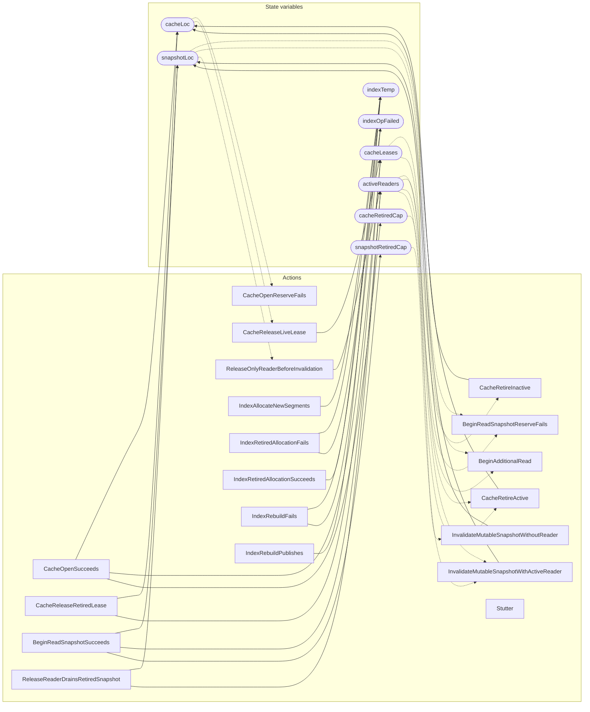

<!-- GENERATED FILE: do not edit. Regenerate with `make -C zig tla-viz` (scripts/tla-viz/gen_structural.py). -->

# AntflyLsmLifecycle — structural diagrams

Generated from [`AntflyLsmLifecycle.tla`](../../../storage/lsm/AntflyLsmLifecycle.tla). 8 state variables, 19 actions in `Next`. 1 expected-failure mutant action(s) (gated by `Buggy*` constants) omitted.

## Phase state machines

Transitions are extracted from action guards and primed updates; edge labels are the actions that perform the transition.

### `cacheLoc`

### `snapshotLoc`

### `indexTemp`

## Actions and the state they touch

| Action | Reads (incl. helper operators) | Writes |
| --- | --- | --- |
| `CacheOpenReserveFails` | `cacheLoc` | — |
| `CacheOpenSucceeds` | `cacheLoc`, `cacheLeases`, `cacheRetiredCap` | `cacheLoc`, `cacheLeases`, `cacheRetiredCap` |
| `CacheReleaseLiveLease` | `cacheLoc`, `cacheLeases` | `cacheLeases` |
| `CacheRetireInactive` | `cacheLoc`, `cacheLeases` | `cacheLoc` |
| `CacheRetireActive` | `cacheLoc`, `cacheLeases`, `cacheRetiredCap` | `cacheLoc` |
| `CacheReleaseRetiredLease` | `cacheLoc`, `cacheLeases` | `cacheLoc`, `cacheLeases` |
| `BeginReadSnapshotReserveFails` | `snapshotLoc`, `activeReaders` | — |
| `BeginReadSnapshotSucceeds` | `snapshotLoc`, `activeReaders` | `snapshotLoc`, `activeReaders`, `snapshotRetiredCap` |
| `BeginAdditionalRead` | `snapshotLoc`, `activeReaders` | — |
| `InvalidateMutableSnapshotWithActiveReader` | `snapshotLoc`, `activeReaders`, `snapshotRetiredCap` | `snapshotLoc` |
| `ReleaseOnlyReaderBeforeInvalidation` | `snapshotLoc`, `activeReaders` | `activeReaders` |
| `InvalidateMutableSnapshotWithoutReader` | `snapshotLoc`, `activeReaders` | `snapshotLoc` |
| `ReleaseReaderDrainsRetiredSnapshot` | `snapshotLoc`, `activeReaders` | `snapshotLoc`, `activeReaders` |
| `IndexAllocateNewSegments` | `indexTemp` | `indexTemp` |
| `IndexRetiredAllocationFails` | `indexTemp` | `indexTemp`, `indexOpFailed` |
| `IndexRetiredAllocationSucceeds` | `indexTemp` | `indexTemp` |
| `IndexRebuildFails` | `indexTemp` | `indexTemp`, `indexOpFailed` |
| `IndexRebuildPublishes` | `indexTemp` | `indexTemp` |
| `Stutter` | — | — |

## Write graph

Solid edges: the action updates the variable. Dotted edges: the action's own definition reads the variable (reads via helper operators appear in the table above, not here).

