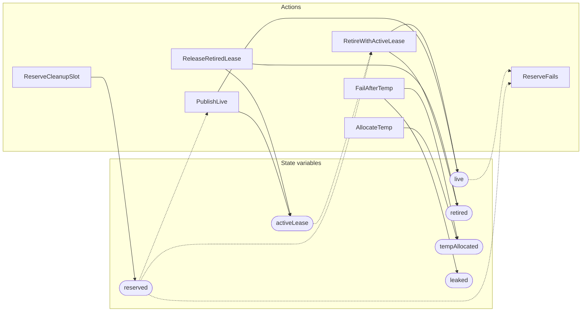

<!-- GENERATED FILE: do not edit. Regenerate with `make -C zig tla-viz` (scripts/tla-viz/gen_structural.py). -->

# AntflyLsmReserveCleanup — structural diagrams

Generated from [`AntflyLsmReserveCleanup.tla`](../../../storage/lsm/AntflyLsmReserveCleanup.tla). 6 state variables, 7 actions in `Next`.

## Actions and the state they touch

| Action | Reads (incl. helper operators) | Writes |
| --- | --- | --- |
| `ReserveCleanupSlot` | `reserved` | `reserved` |
| `ReserveFails` | `reserved`, `live` | — |
| `PublishLive` | `reserved`, `live` | `live`, `activeLease` |
| `RetireWithActiveLease` | `reserved`, `live`, `activeLease` | `live`, `retired` |
| `ReleaseRetiredLease` | `activeLease`, `retired` | `activeLease`, `retired` |
| `AllocateTemp` | `tempAllocated` | `tempAllocated` |
| `FailAfterTemp` | `tempAllocated` | `tempAllocated`, `leaked` |

## Write graph

Solid edges: the action updates the variable. Dotted edges: the action's own definition reads the variable (reads via helper operators appear in the table above, not here).

