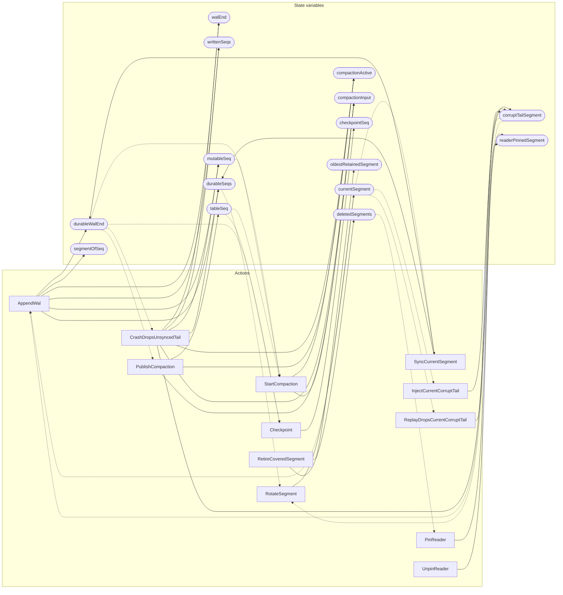

<!-- GENERATED FILE: do not edit. Regenerate with `make -C zig tla-viz` (scripts/tla-viz/gen_structural.py). -->

# AntflyLsmWalCompaction — structural diagrams

Generated from [`AntflyLsmWalCompaction.tla`](../../../storage/lsm/AntflyLsmWalCompaction.tla). 15 state variables, 12 actions in `Next`. 3 expected-failure mutant action(s) (gated by `Buggy*` constants) omitted.

## Actions and the state they touch

| Action | Reads (incl. helper operators) | Writes |
| --- | --- | --- |
| `AppendWal` | `walEnd`, `writtenSeqs`, `durableSeqs`, `segmentOfSeq`, `currentSegment`, `corruptTailSegment` | `walEnd`, `durableWalEnd`, `writtenSeqs`, `durableSeqs`, `segmentOfSeq`, `mutableSeq` |
| `SyncCurrentSegment` | `writtenSeqs`, `durableSeqs`, `segmentOfSeq`, `currentSegment` | `durableWalEnd`, `durableSeqs` |
| `RotateSegment` | `writtenSeqs`, `durableSeqs`, `segmentOfSeq`, `currentSegment`, `corruptTailSegment` | `currentSegment` |
| `InjectCurrentCorruptTail` | `writtenSeqs`, `segmentOfSeq`, `currentSegment`, `corruptTailSegment` | `corruptTailSegment` |
| `ReplayDropsCurrentCorruptTail` | `currentSegment`, `corruptTailSegment` | `corruptTailSegment` |
| `CrashDropsUnsyncedTail` | `walEnd`, `durableWalEnd`, `durableSeqs` | `walEnd`, `writtenSeqs`, `durableSeqs`, `mutableSeq`, `compactionActive`, `compactionInput`, `corruptTailSegment` |
| `StartCompaction` | `durableWalEnd`, `mutableSeq`, `tableSeq`, `compactionActive` | `compactionActive`, `compactionInput` |
| `PublishCompaction` | `durableWalEnd`, `compactionActive`, `compactionInput` | `tableSeq`, `compactionActive`, `compactionInput` |
| `Checkpoint` | `durableWalEnd`, `checkpointSeq`, `tableSeq` | `checkpointSeq` |
| `PinReader` | `writtenSeqs`, `segmentOfSeq`, `readerPinnedSegment`, `deletedSegments` | `readerPinnedSegment` |
| `UnpinReader` | `readerPinnedSegment` | `readerPinnedSegment` |
| `RetireCoveredSegment` | `writtenSeqs`, `segmentOfSeq`, `currentSegment`, `oldestRetainedSegment`, `checkpointSeq`, `readerPinnedSegment`, `deletedSegments` | `oldestRetainedSegment`, `deletedSegments` |

## Write graph

Solid edges: the action updates the variable. Dotted edges: the action's own definition reads the variable (reads via helper operators appear in the table above, not here).

